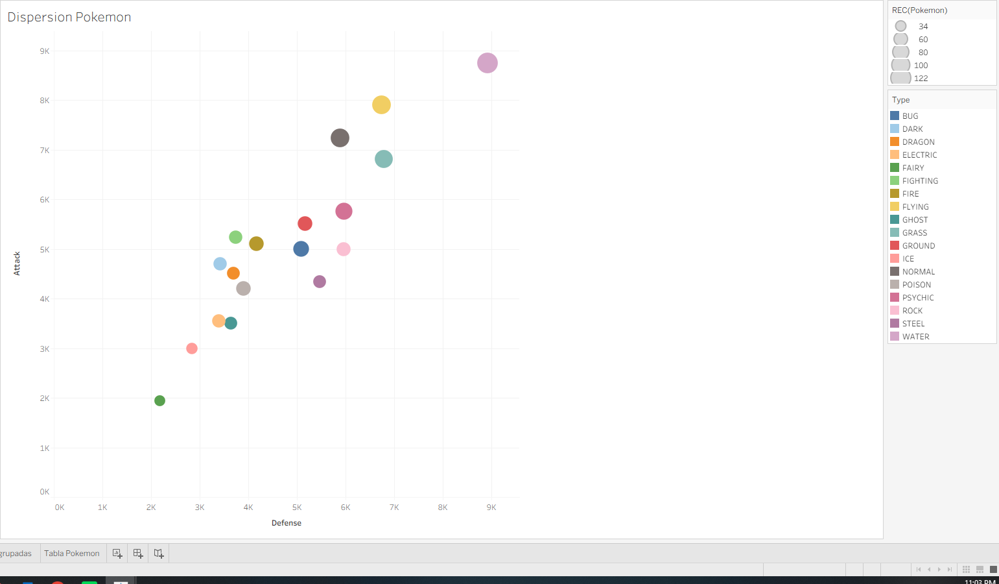
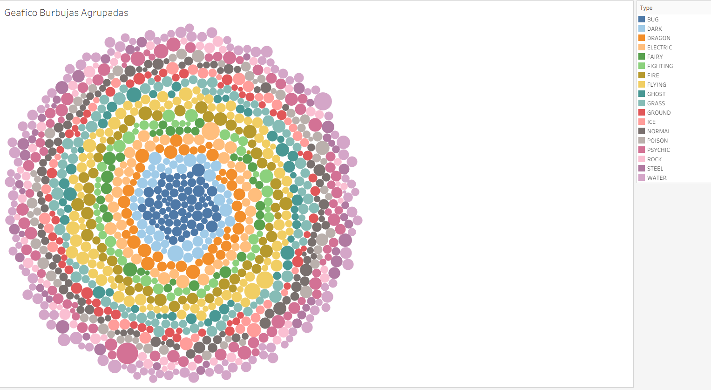

# Dashboard de Estadísticas de Pokémon

Este proyecto muestra un **libro de trabajo en Tableau** con diferentes visualizaciones para analizar las estadísticas de Pokémon, incluyendo ataque, defensa, velocidad, HP y total.

## 📊 Visualizaciones

### Gráfico de dispersión

### Gráfico de burbujas agrupadas

## 🚀 Visualizaciones incluidas
- **Gráfico de dispersión:** relación entre ataque y defensa, con color por total y tamaño por velocidad.
- **Gráfico de burbujas agrupadas:** comparación de atributos con burbujas de distinto tamaño y color.
- **Heatmap de atributos:** tabla coloreada por valores para identificar fortalezas y debilidades.

## ⚙️ Aspectos Técnicos
- Dataset con múltiples atributos de Pokémon.
- Uso de `Measure Names` y `Measure Values` para mostrar varias métricas.
- Aplicación de paletas de colores divergentes para destacar extremos.
- Visualizaciones interactivas en Tableau.

## 📁 Archivos
- `pokemon-stats.twbx` → Libro de trabajo empaquetado con todas las hojas y dashboards.
- `dispersión Pokémon.PNG` → Captura del gráfico de dispersión.
- `burbujas agrupadas Pokémon.PNG` → Captura del gráfico de burbujas agrupadas.

## 📖 Cómo abrir el proyecto
1. Descargá el archivo `.twbx`.  
2. Abrilo en **Tableau Desktop** o **Tableau Public**.  
3. Explorá las visualizaciones interactivas.  
